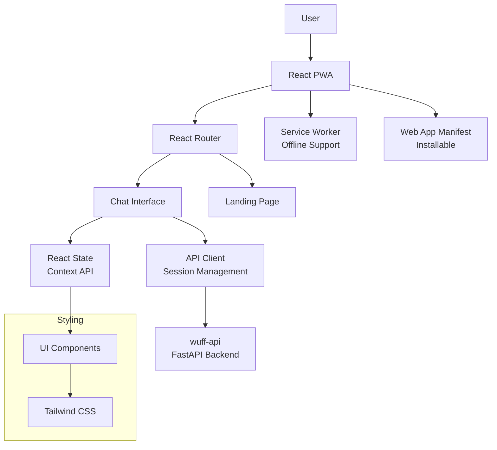

# WuffChat Frontend Application

**Production V2**: React 19 PWA with Vite | **V3 Ready**: Enhanced UI for agentic interactions

Modern Progressive Web Application providing the conversational interface for WuffChat's AI dog behavior consultations.

## Technical Architecture



### Core Components
- **ChatInterface**: Real-time messaging with typing indicators
- **SessionManager**: Token-based session persistence  
- **MessageRenderer**: Markdown support with presence markers
- **ProgressTracker**: Visual conversation state indicators
- **PWAManager**: Install prompts and offline handling

### State Management
- **React Context**: Global session and conversation state
- **Local Storage**: Session token persistence
- **Error Boundaries**: Graceful error handling and recovery

## Quick Start

```bash
# Install dependencies
npm install

# Configure environment
cp .env.development.template .env.development
# Edit with your API endpoint and key

# Development server
npm run dev

# Production build
npm run build
npm run preview
```

## Environment Configuration

```bash
# .env.development
VITE_API_URL=http://localhost:8000
VITE_API_KEY=your-development-key
```

## Performance Optimizations

### Bundle Analysis
- **Gzipped Size**: ~63KB total bundle
- **Code Splitting**: Lazy-loaded routes
- **Tree Shaking**: Dead code elimination
- **Asset Optimization**: Image compression and format selection

### Runtime Performance
- **Virtual Scrolling**: For long conversation histories
- **Debounced Inputs**: Reduced API calls during typing
- **Memoization**: React.memo for expensive components
- **Service Worker**: Caching strategies for static assets

## Progressive Web App Features

### Installability
```json
{
  "name": "WuffChat",
  "short_name": "WuffChat",
  "display": "standalone",
  "start_url": "/",
  "theme_color": "#1f2937"
}
```

### Offline Support
- **Service Worker**: Caches critical assets and API responses
- **Fallback Pages**: Offline messaging when backend unavailable
- **Background Sync**: Queues messages when offline

### Mobile Optimization
- **Touch Gestures**: Swipe interactions for mobile users
- **Viewport Meta**: Proper scaling and zoom prevention
- **iOS Integration**: Apple touch icons and status bar styling

## API Integration

### Session Flow
```typescript
// Initialize conversation
const response = await fetch('/flow_intro', {
  method: 'POST',
  headers: { 'X-API-Key': apiKey },
  body: JSON.stringify({ message: userInput })
});

// Continue conversation
const stepResponse = await fetch('/flow_step', {
  method: 'POST', 
  headers: { 'X-API-Key': apiKey },
  body: JSON.stringify({ 
    session_token: sessionToken,
    message: userInput 
  })
});
```

### Error Handling
- **Network Errors**: Retry logic with exponential backoff
- **Session Expiry**: Automatic session renewal
- **Rate Limiting**: User feedback for API limits
- **Validation Errors**: Form validation and user guidance

## Development Tools

```bash
# Available scripts
npm run dev          # Development server with HMR
npm run build        # Production build
npm run preview      # Preview production build
npm run lint         # ESLint checking
npm run type-check   # TypeScript validation
```

### Code Quality
- **TypeScript**: Full type safety with strict mode
- **ESLint**: Airbnb configuration with React hooks rules
- **Prettier**: Consistent code formatting
- **Husky**: Pre-commit hooks for quality checks

## Deployment

### Production Stack
- **Platform**: Scalingo (app.wuffchat.de)
- **Build**: Vite production build with optimization
- **CDN**: Static asset delivery via CDN
- **Monitoring**: Error tracking and performance metrics

### CI/CD Pipeline
- **GitHub Actions**: Automated testing and deployment
- **Environment Variables**: Secure secret management
- **Branch Protection**: Main branch deployment only

---

**Back to WuffChat meta-repository** - see [wuffchat](https://github.com/kemperfekt/wuffchat) for complete overview