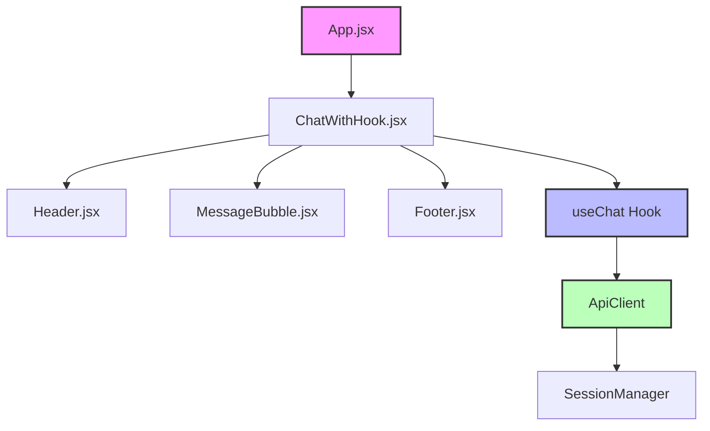
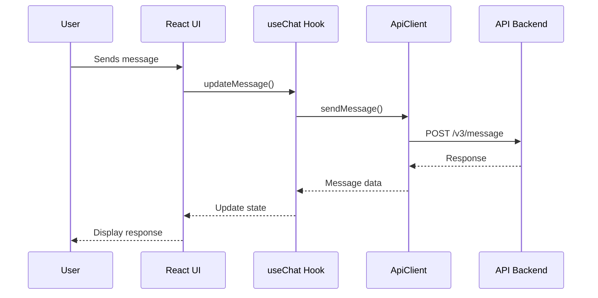
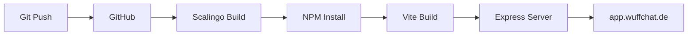
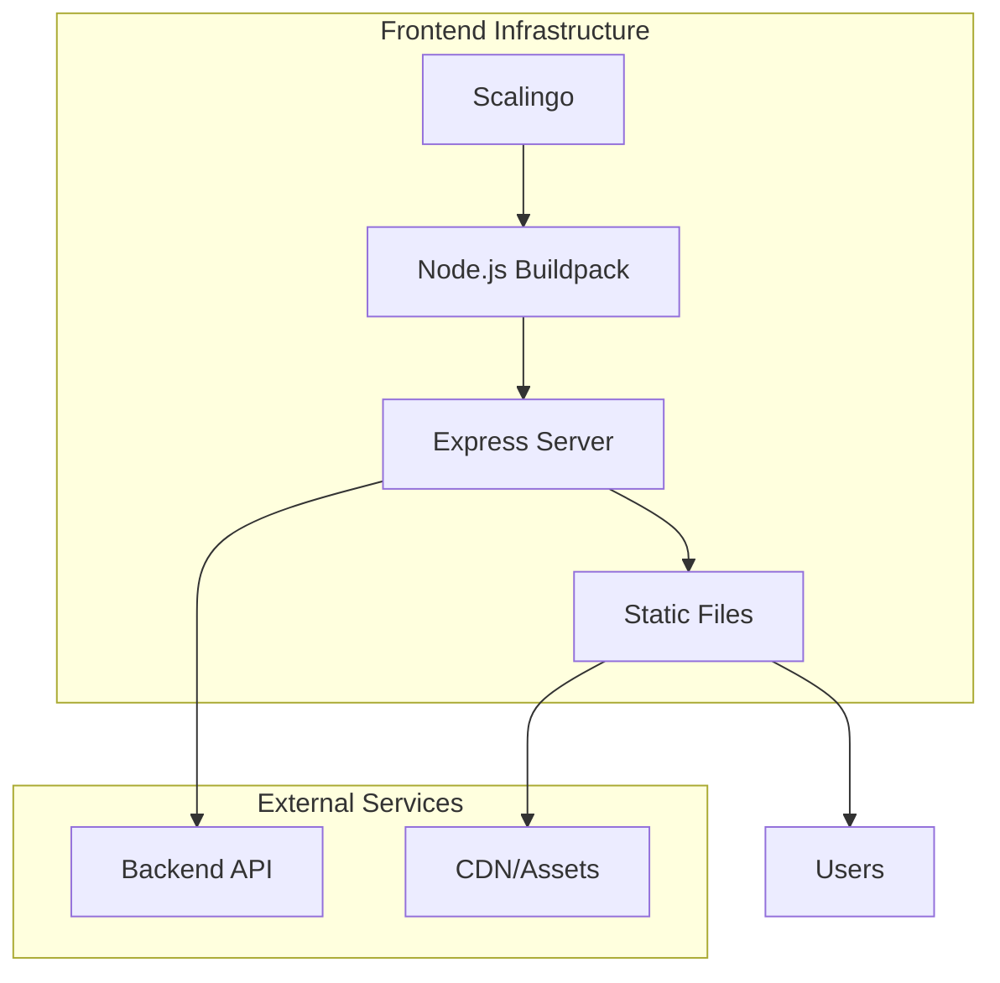

# WuffChat Frontend

A modern React application providing an AI-powered chat interface for dog behavioral advice.

## Overview

WuffChat is a Progressive Web App that connects dog owners with an AI assistant specialized in canine behavior. The frontend provides a clean, intuitive chat interface where users can describe their dog's behavior and receive expert advice from the dog's perspective.

**Key Highlights:**
- Built with Vite and React for optimal performance
- Progressive Web App with offline capabilities
- Fully responsive design optimized for mobile devices
- Compatible with both V2 and V3 backend APIs

## Architecture

### Component Structure



### Data Flow



### Key Architectural Decisions

- **Single Page Application**: Smooth user experience without page reloads
- **Custom Hook Pattern**: Centralized state management with `useChat`
- **API Abstraction Layer**: Clean separation between UI and backend communication
- **Session Persistence**: Automatic session management with 30-minute timeout

## Tech Stack

| Category | Technology | Version | Purpose |
|----------|------------|---------|---------|
| **Build Tool** | Vite | 6.3.5 | Fast development and optimized builds |
| **Framework** | React | 19.1.0 | UI component library |
| **Styling** | Tailwind CSS | 4.1.8 | Utility-first CSS framework |
| **Icons** | Lucide React | 0.513.0 | Consistent icon system |
| **PWA** | Vite PWA Plugin | 1.0.0 | Progressive Web App capabilities |
| **Server** | Express | 4.21.1 | Production static file serving |
| **Testing** | Vitest | 3.2.2 | Unit and component testing |

## Getting Started

### Prerequisites

- Node.js 18+ and npm 9+
- Git for version control

### Installation

```bash
# Clone the repository
git clone https://github.com/kemperfekt/dogbot-web.git
cd dogbot-web

# Install dependencies
npm install

# Copy environment template
cp .env.development.template .env.development
```

### Environment Configuration

Create a `.env.development` file with:

```env
VITE_API_URL=http://localhost:8000
VITE_API_KEY=your_api_key_here
VITE_API_VERSION=v3
VITE_DEBUG_MODE=true
```

### Development Setup

```bash
# Start development server
npm run dev

# The app will be available at http://localhost:3000
```

## Development

### Available Scripts

| Script | Description |
|--------|-------------|
| `npm run dev` | Start development server with hot reload |
| `npm run build` | Create production build |
| `npm run preview` | Preview production build locally |
| `npm run test` | Run test suite |
| `npm run lint` | Run ESLint checks |
| `npm start` | Start production server |

### Project Structure

```
dogbot-web/
├── src/
│   ├── components/        # React components
│   │   ├── Chat.jsx      # V2 compatible chat
│   │   ├── ChatV3.jsx    # V3 enhanced features
│   │   └── ChatWithHook.jsx # Main chat component
│   ├── hooks/            # Custom React hooks
│   │   └── useChat.js    # Chat state management
│   ├── services/         # API integration
│   │   └── apiClient.js  # Centralized API client
│   ├── utils/            # Utility functions
│   │   └── sessionManager.js # Session handling
│   └── App.jsx           # Root component
├── public/               # Static assets
├── server.js            # Express production server
└── vite.config.js       # Vite configuration
```

### Component Overview

**Core Components:**
- `ChatWithHook`: Main chat interface using the custom hook
- `Header`: Application header with branding
- `MessageBubble`: Individual message display with avatars
- `Footer`: Message input and send controls

**Key Features:**
- Real-time message updates
- Typing indicators
- Error boundaries
- Session persistence
- Responsive design

### API Integration

The `ApiClient` class provides:
- Automatic V2/V3 endpoint routing
- Request deduplication
- Error handling with user-friendly messages
- Session token management
- Environment-based configuration

## Deployment

### Build Process

```bash
# Create optimized production build
npm run build

# Output will be in dist/ directory
# - index.html (entry point)
# - assets/ (JS, CSS, images)
# - PWA manifest and service worker
```

### Production Deployment

The application is deployed on Scalingo with automatic builds:



### Environment Variables

Production environment requires:

| Variable | Description | Example |
|----------|-------------|---------|
| `VITE_API_URL` | Backend API URL | `https://api.wuffchat.de` |
| `VITE_API_KEY` | API authentication key | `your-production-key` |
| `VITE_API_VERSION` | API version | `v3` |
| `PORT` | Server port | `4173` |

### Infrastructure Overview



## Features

### Core Functionality

- **Real-time Chat**: Instant message sending and receiving
- **Session Management**: Automatic session creation and persistence
- **Error Recovery**: Graceful handling of network issues
- **Responsive Design**: Optimized for all device sizes

### PWA Capabilities

- **Installable**: Add to home screen on mobile devices
- **Offline Support**: Basic functionality without network
- **Auto-Update**: Seamless updates without app store
- **Native Feel**: Full-screen experience

### API Compatibility

The frontend supports multiple API versions:
- **V3 (Default)**: Enhanced agent-based responses
- **V2 (Legacy)**: Basic chat functionality
- Automatic fallback on version mismatch

### Security Features

The application implements several security best practices:
- **Environment Variable Management**: Secure configuration handling
- **Session Token Security**: Proper token storage and lifecycle management
- **API Key Protection**: Secure API authentication
- **Dependency Management**: Regular security updates and vulnerability monitoring
- **Content Security**: Input validation and XSS protection measures
- **HTTPS Ready**: SSL/TLS encryption support for production deployments

## Testing

### Running Tests

```bash
# Run all tests
npm test

# Run with coverage
npm test -- --coverage

# Run in watch mode
npm test -- --watch
```

### Test Structure

```
src/
├── components/__tests__/
│   ├── Chat.test.jsx
│   └── MessageBubble.test.jsx
├── hooks/__tests__/
│   └── useChat.test.js
└── setupTests.js
```

## Contributing

### Development Workflow

1. Fork the repository
2. Create a feature branch (`git checkout -b feature/your-feature`)
3. Make your changes
4. Run tests (`npm test`)
5. Commit changes (`git commit -m 'Add your feature'`)
6. Push to branch (`git push origin feature/your-feature`)
7. Open a Pull Request

### Code Standards

- Use ESLint configuration for code style
- Write tests for new components
- Keep components small and focused
- Document complex logic

### Pull Request Process

1. Update documentation for any API changes
2. Ensure all tests pass
3. Request review from maintainers
4. Address review feedback

## License

This project is licensed under the MIT License - see the [LICENSE](LICENSE) file for details.

---
